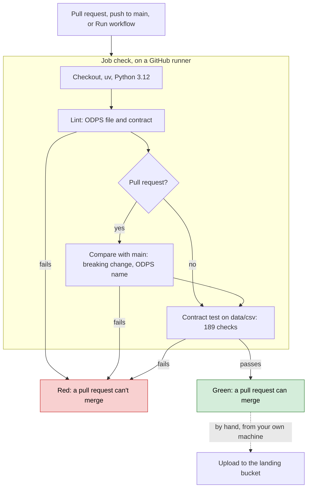

# GitHub Action

The workflow [`.github/workflows/ci.yml`](.github/workflows/ci.yml) checks the data product on each pull request, each push to `main`, and by hand with "Run workflow" in the Actions tab. Its one job, `check`, fails when the ODPS file or the data contract is invalid, when a pull request breaks the contract, or when the CSV files in `data/csv/` no longer match the contract. That job is the gate before an upload to the landing bucket.



## Steps

| Step | What it does | Fails when |
|---|---|---|
| Lint | `dataproduct lint` on the ODPS file and `datacontract lint` on the contract ([Data Product Manifest](README.md#data-product-manifest), [Lint](data-contract/data-contract.md#4-lint)) | A file doesn't match its JSON schema |
| Compare with main | Only on a pull request: `datacontract breaking` compares the contract on `main` with the one in the pull request ([Move it to data/](data-contract/data-contract.md#3-move-it-to-data)), and the ODPS `name` must stay the same, or the portal gets a second data product. A file not yet on `main` is skipped | A breaking change, such as a removed or retyped column, or a new ODPS `name` |
| Contract test on data/csv | `datacontract test --no-inline-references --server local` ([Test](data-contract/data-contract.md#5-test)) | One of the 189 checks fails |

## The contract test

`--server local` picks the server `local` in the contract:

```yaml
- server: local
  type: local
  format: csv
  path: data/csv/{model}.csv
```

datacontract-cli fills in `{model}` with the `name` of each table under `schema:`: `patients` reads `data/csv/patients.csv`, and the same for `encounters`, `conditions`, `observations`, `medications` and `procedures`. It loads each file into DuckDB as a view with the table's name and checks each column: present, its type, no missing values where `required`, no duplicates where `unique`, and each relationship, e.g. every `procedures.PATIENT` is in `patients.Id`. So a CSV file's name must be its table's `name` in the contract.

## Settings

| What | Value |
|---|---|
| `DATAPRODUCT`, `DATACONTRACT` | The same versions as `requirements.txt`: update both together |
| Python | 3.12, as in the README, step 7 |
| Runners | GitHub's: free without a limit for a public repo ([billing](https://docs.github.com/en/billing/concepts/product-billing/github-actions)) |
| Permissions, keys | Read the repo only; no key, as the data is in the repo |
| `concurrency` | A new push cancels the run still busy on the same branch |
| Not in CI | The upload to RustFS and the portal: GitHub's runners can't reach them |
| Never | A self-hosted runner, e.g. on your Mac: in a public repo anyone can open a pull request and run code on it ([GitHub's security guide](https://docs.github.com/en/actions/reference/security/secure-use)) |

## Run it locally

From the repo root, in the Python environment of the README, step 7:

```sh
dataproduct lint synthea-ms-data.odps.yaml --local-references
datacontract lint --no-inline-references data/synthea-ms-data.odcs.yaml
datacontract test --no-inline-references --server local data/synthea-ms-data.odcs.yaml
```

## Require the check

In the repo's settings on GitHub, add a branch protection rule on `main` that requires the status check `check` ([protected branches](https://docs.github.com/en/repositories/configuring-branches-and-merges-in-your-repository/managing-protected-branches/about-protected-branches)). A pull request then can't merge while the check fails.
